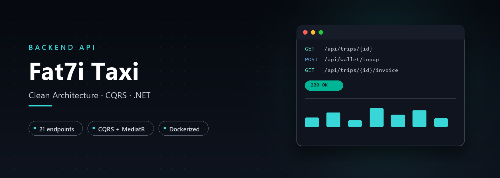
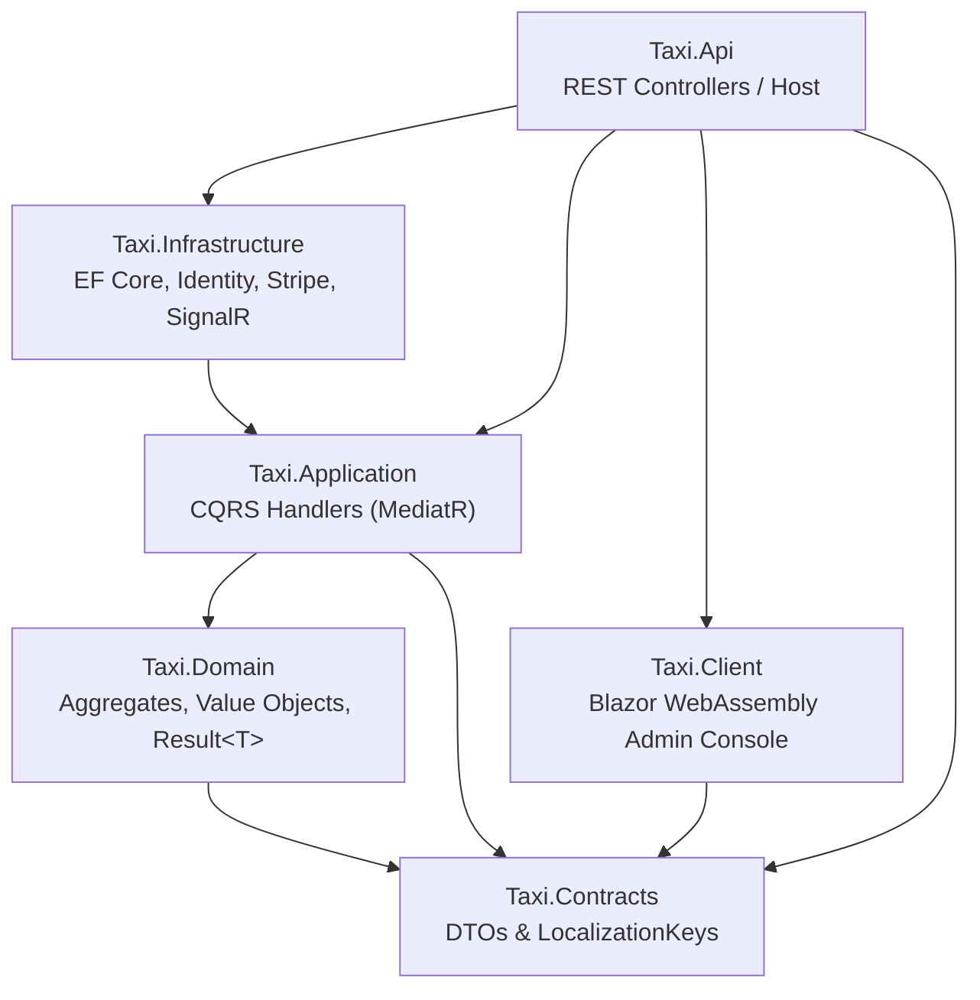

<div align="center">
  
</div>

<div align="center">

# Fat7i Taxi API

**Backend for the Fat7i taxi platform — trip lifecycle, payments, wallet, and real-time driver dispatch behind a single Clean Architecture / CQRS service.**

<p>
  
</p>
<p>
  
  
</p>

</div>

<div align="center">

[Overview](#overview) ·
[Features](#features) ·
[Tech Stack](#tech-stack) ·
[Architecture](#architecture) ·
[API Overview](#api-overview) ·
[Project Structure](#project-structure) ·
[Getting Started](#getting-started) ·
[Languages](#supported-languages)

</div>

---

## Overview

This is the API that powers the Fat7i taxi platform: it serves **customertaxi** (the passenger-facing mobile app) and **dashboardtaxi** (the driver/operations app) as separate client applications, plus ships an in-repo Blazor WebAssembly admin console (`Taxi.Client`) for internal operations. The service owns the full trip lifecycle — booking, pricing, driver dispatch, live status via SignalR — alongside payments (Stripe), an internal passenger wallet, PDF invoicing, and backend-owned OTP authentication with SMS/email delivery.

It's built as a Clean Architecture solution with a strict CQRS pipeline (MediatR + FluentValidation), designed to run as a small, self-hostable Docker Compose stack behind Caddy.

---

## Features

**Trips & Dispatch**
- 🚕 Full trip state machine — request, pricing quote, driver assignment, live tracking, stops, completion, cancellation
- 📡 Real-time updates over SignalR (driver assignment, trip status push)
- 🗺️ Route search, reverse geocoding, and pricing quotes via a Maps integration
- 📨 In-trip messaging between passenger and driver

**Payments & Money**
- 💳 Stripe PaymentIntents — fare charged at booking confirmation, not at trip completion, reconciled via signature-validated webhooks
- 👛 Passenger wallet with balance and transaction history, plus wallet top-ups
- 🧾 Server-rendered PDF invoices (QuestPDF) per completed trip
- ↩️ Centralized refund lifecycle — cancellations, compensation claims, and admin-initiated refunds all funnel through one idempotent refund service, with retry and audit trail

**Identity & Auth**
- 🔐 Backend-owned OTP authentication — phone (SMS), email, and Google Sign-In, each independently verifiable per account
- 🪪 JWT access tokens + refresh tokens, with session revocation on password reset/logout
- 👮 Role-based authorization for passengers, drivers, and admins, including a separate admin login and driver document review/approval workflow

**Platform**
- 🌍 Notifications and backend error messages localized into 9 languages
- 📱 Remote client version gate (forced update / soft nudge) for the customer app, editable from the admin side with no deploy required
- 📈 Structured logging (Serilog → Seq) and OpenTelemetry tracing/metrics (Prometheus)
- 🧯 Audit log of sensitive admin actions
- 🚨 Customer incident reporting

---

## Tech Stack

| Layer | Technology |
|---|---|
| Runtime | .NET 10 |
| API | ASP.NET Core Web API, API versioning, rate limiting, output caching |
| CQRS | MediatR + FluentValidation pipeline behaviors |
| Persistence | EF Core 10 on PostgreSQL (Npgsql), JSONB for bilingual/localized fields |
| Auth | ASP.NET Core Identity + JWT, backend-owned OTP (SMS via CM.com, email via Titan SMTP), Google Sign-In via Firebase Admin SDK |
| Payments | Stripe.net |
| Real-time | SignalR |
| Caching | `Microsoft.Extensions.Caching.Hybrid`, culture-partitioned |
| PDF generation | QuestPDF |
| Observability | Serilog + Seq, OpenTelemetry (traces/metrics), Prometheus, Grafana |
| API docs | Swagger/Swashbuckle + Scalar (dev only) |
| Admin frontend | Blazor WebAssembly (in-repo, `Taxi.Client`) |
| Infra | Docker Compose, Caddy (reverse proxy + automatic TLS) |

---

## Architecture

The solution follows Clean Architecture with a strict inward dependency rule, organized internally as CQRS vertical slices (one folder per feature, under `Features/`, containing its command/query, handler, and validator together).

- **Taxi.Contracts** — the innermost layer: DTOs, request/response shapes, and the centralized `LocalizationKeys` registry. No dependencies of its own.
- **Taxi.Domain** — aggregates, value objects, domain events, and the `Result<T>` pattern used instead of exceptions for expected business failures.
- **Taxi.Application** — MediatR command/query handlers, validators, and pipeline behaviors (validation, caching).
- **Taxi.Infrastructure** — EF Core (`AppDbContext`), ASP.NET Identity, Stripe integration, SignalR hubs, background jobs, and every other implementation of an `Application`-defined interface.
- **Taxi.Api** — REST controllers, middleware, OpenAPI/Scalar docs, and the composition root that wires everything together.
- **Taxi.Client** — a Blazor WebAssembly admin console consuming the API's public contracts.



Business failures use a functional `Result<T>` instead of thrown exceptions; the API layer maps `Result.Failure` into RFC 7807 `application/problem+json` responses at the boundary, so internal errors never leak upward as stack traces.

---

## API Overview

Swagger UI and Scalar are available at `/swagger` and `/scalar` when running in Development. Routes are versioned (`/api/v{version}/...`) and follow a consistent REST-ish naming convention (plural nouns, kebab-case, sub-resources for actions). Controllers are grouped below by functional area:

| Area | Controllers | Responsibility |
|---|---|---|
| Auth & Identity | `AuthController`, `IdentityController`, `AdminsController`, `UsersController` | OTP/Google sign-up & login, sessions, current-user profile, admin accounts |
| Trips | `TripsController`, `TripMessagesController` | Booking, pricing quotes, driver assignment, trip lifecycle, in-trip chat |
| Drivers & Vehicles | `DriversController`, `DriverDocumentsController`, `VehicleTypesController` | Driver management, KYC document review/approval, vehicle types |
| Payments & Wallet | `PaymentMethodsController`, `PaymentPreferencesController`, `WalletController`, `RefundsController`, `RefundIssuesController`, `WebhooksController` | Saved payment methods, passenger wallet, refund lifecycle, Stripe webhook intake |
| Support | `CustomerIncidentsController`, `NotificationsController` | Incident reporting, push/notification management |
| Platform | `AppConfigController`, `AuditLogsController`, `MapsController`, `UploadsController` | Client config & version gate, admin audit trail, maps/geocoding proxy, file uploads |

---

## Project Structure

<details>
<summary><b>Solution layout (src/ and tests/)</b></summary>

```text
src/
├── Taxi.Domain          # Aggregates, Value Objects, Domain Events, Result<T>
├── Taxi.Contracts       # DTOs, Requests, Responses, LocalizationKeys
├── Taxi.Application     # CQRS handlers (vertical slices), validators, pipeline behaviors
├── Taxi.Infrastructure  # EF Core, Identity, Stripe, SignalR, background jobs
├── Taxi.Api             # REST controllers, middleware, OpenAPI, composition root
└── Taxi.Client          # Blazor WebAssembly admin console
tests/
├── Taxi.Domain.UnitTests
├── Taxi.Application.UnitTests
├── Taxi.Api.IntegrationTests
├── Taxi.Api.EndToEndTests
└── Taxi.Testing          # Shared fixtures, builders, test doubles
```

</details>

---

## Getting Started

### Prerequisites

- [.NET 10 SDK](https://dotnet.microsoft.com/download)
- [Docker](https://www.docker.com/) + Docker Compose

### Clone

```bash
git clone git@github.com:fat7i-alghareeb/taxi_system_backend.git
cd taxi_system_backend
```

### Configure

Copy the example environment file and fill in your own values — never commit a real `.env`:

```bash
cp .env.example .env
```

<details>
<summary><b>What <code>.env.example</code> documents</b></summary>

- **Database** — PostgreSQL user/password, whether migrations apply on startup
- **JWT** — signing secret
- **Admin seeding** — passwords for the two bootstrap admin accounts (required outside Development; seeding refuses to start without them)
- **Google Maps** — Places/Directions API key
- **Firebase** — service-account credentials, used for Google Sign-In token verification
- **Stripe** — secret/publishable keys, webhook secret, test-mode flag
- **Invoicing** — issuer name/address/VAT number printed on generated PDFs
- **OTP policy** — code length, expiry, resend cooldown, HMAC hash secret
- **CM.com** — SMS gateway product token (phone OTP delivery)
- **Titan.email** — SMTP credentials (email OTP delivery)
- **Observability** — Grafana admin password

</details>

### Run locally

With Docker Compose (Postgres, Seq, Prometheus, Grafana, and the API):

```bash
docker compose -f docker-compose.yml -f docker-compose.dev.yml up -d --build
```

Or run just the infrastructure in containers and the API from your IDE:

```bash
docker compose up -d                 # Postgres + Seq only
dotnet ef database update --project src/Taxi.Infrastructure --startup-project src/Taxi.Api
dotnet run --project src/Taxi.Api
```

A production layout (Caddy reverse proxy with automatic TLS, locked-down ports, explicit migration step) is documented in [`DEPLOYMENT.md`](DEPLOYMENT.md).

### Run tests

```bash
dotnet test
```

Coverage spans domain unit tests (aggregates, value objects, state machines), application unit tests (CQRS handlers including the Stripe and wallet flows), and API-level integration/end-to-end tests (auth, drivers, wallet, SignalR hubs).

---

## Supported Languages

Backend-driven notification and error-message strings are localized into 9 languages:

Arabic (ar) · German (de) · English (en) · Spanish (es) · French (fr) · Dutch (nl) · Polish (pl) · Romanian (ro) · Ukrainian (uk)

---

## Contributing

This is currently a portfolio/product project maintained by a single team. Issues and pull requests are welcome — please open an issue to discuss significant changes before submitting a PR.

---

<div align="center">

Built by [Fat7i](https://github.com/fat7i-alghareeb)

[⬆ Back to top](#fat7i-taxi-api)

</div>
